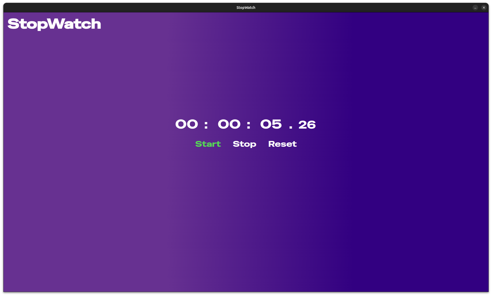

# ⏱️ StopWatch

A simple Stopwatch desktop application built with **Electron**, **HTML**, **CSS**, and **JavaScript**. Designed with a custom UI, this stopwatch is packaged as a `.deb` executable for Linux (Ubuntu).



---

## 📦 Features

- Start, Stop, and Reset stopwatch with custom-styled buttons
- Smooth digit animation without jitter
- Precise time formatting with decimal seconds (`SS.CC`)
- Electron-powered for desktop support (Linux `.deb` + AppImage)

---

## 🚀 Getting Started

### Option 1: Build from source

#### 📁 Clone the repository

```bash
git clone https://github.com/Celian974/StopWatch.git
```
#### 📁 Navigate to the StopWatch directory

```bash
cd StopWatch
```
#### 📥 Install the App (.deb)

```bash
sudo dpkg -i dist/stopwatch_1.0.0_amd64.deb
```

- The app will then appear among your applications with a "SW" desktop icon (for StopWatch).

### Option 2: Download from Releases

You can download the `.deb` package directly from the `Releases` page and install it with :

```bash
sudo dpkg -i stopwatch_1.0.0_amd64.deb
```
- The app will then appear among your applications with a "SW" desktop icon (for StopWatch).

---
## 🛠️ Technologies used

- Electron
- HTML/CSS/JavaScript
- Canva (for icons design)
---
## 🧑‍💻 Author

Celian SIAMPIRAVE

---
## 📝 License
This project is licensed under the MIT License.